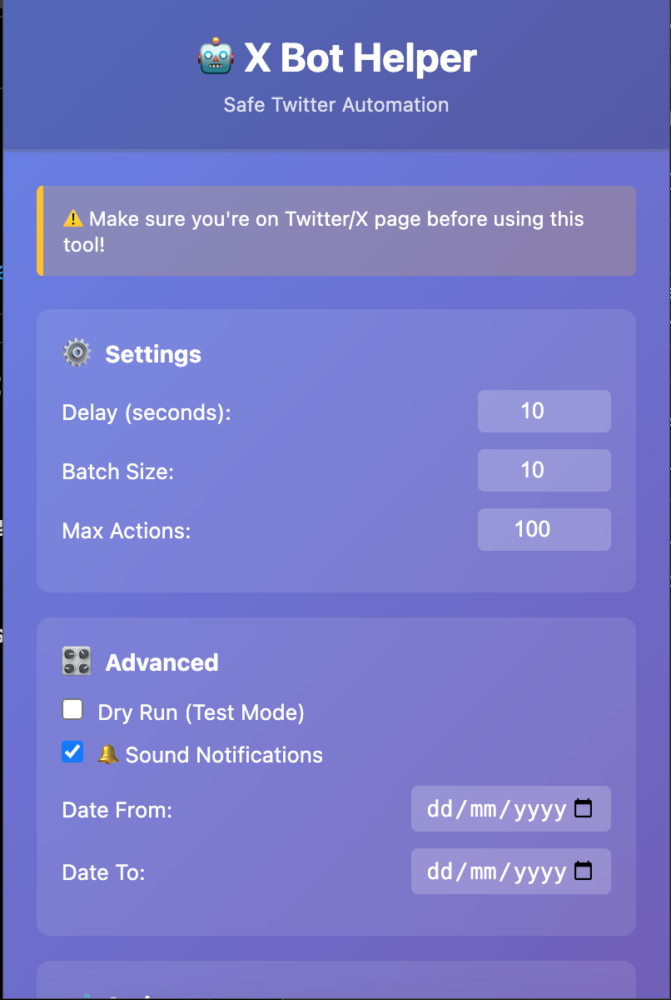

# X Bot Helper - Chrome Extension 🤖

**Safe Twitter/X Automation via Chrome Extension**

## 📸 Preview




## 🎯 Quick Links

- 📚 **[Complete Documentation](docs/README.md)** - All guides and references
- 🚀 **[Quick Start](docs/guides/QUICK_START.md)** - Get started in 5 minutes
- 📖 **[Full Walkthrough](docs/walkthrough.md)** - Detailed feature guide
- 🐛 **[Troubleshooting](docs/guides/TROUBLESHOOT.md)** - Common issues

## ✨ Features

### 🤖 Bot Actions (5 Total)

1. **🗑️ Delete Posts** - Mass delete your tweets/posts
2. **🔄 Undo Retweets** - Remove all your retweets
3. **💔 Undo Likes** - Unlike all liked tweets
4. **🗨️ Delete Replies** - Delete your reply tweets (NEW!)
5. **👥 Unfollow Non-Followers** - Unfollow users who don't follow back (NEW!)

### 🎛️ Advanced Features

#### Phase 1 - Core Control

- **📅 Date Range Filter** - Only process tweets within specific date range
- **🧪 Dry Run Mode** - Preview actions without making changes
- **⏸️ Pause/Resume** - Control execution in real-time
- **🛑 Stop** - Immediately halt any running action

#### Phase 2 - Data & Persistence

- **📊 Export Results** - Download action logs as CSV
- **💾 Progress Persistence** - Auto-save progress, continue later
- **🔁 Auto-Retry** - Automatically retry failed actions

#### Phase 3 - UX Enhancements

- **🔔 Notification Sounds** - Audio feedback for completion
- **⌨️ Keyboard Shortcuts** - Quick access to actions (Space, Escape, Ctrl+D/R/L)
- **📈 Performance Dashboard** - Track action rate and ETA
- **👀 Batch Preview** - See what will be processed

## 🚀 Installation

### Quick Install

1. Open Chrome: `chrome://extensions/`
2. Enable **Developer mode**
3. Click **Load unpacked**
4. Select: `/Applications/ServBay/www/x-bot-automation/extension/`
5. Done! 🎉

**Detailed guide:** [docs/guides/QUICK_START.md](docs/guides/QUICK_START.md)

## 📊 Why This Extension?

### Chrome Extension vs Automated Browser

| Feature        | Puppeteer Bot | Chrome Extension  |
| -------------- | ------------- | ----------------- |
| Detection Risk | ❌ High       | ✅ Low            |
| Browser Type   | Automated     | Real Chrome       |
| Session        | Cookies       | Already logged in |
| Fingerprint    | Different     | Normal Chrome     |
| User Control   | No visibility | See everything    |

**Result:** Extension is **10x safer!**

## 💡 Usage

1. **Login** to Twitter/X normally
2. **Navigate** to appropriate page:
   - Delete Posts → Your profile
   - Delete Replies → Your profile `/with_replies`
   - Unfollow → Your `/following` page
3. **Click** extension icon 🤖
4. **Configure** settings (delay, batch size)
5. **Run** action
6. **Monitor** progress in popup

## 🛡️ Safety Features

- ✅ Customizable delays (3-60 seconds)
- ✅ Batch processing with breaks
- ✅ Random delay variation
- ✅ Action limits
- ✅ Auto-stop on errors
- ✅ Progress persistence
- ✅ Dry run testing mode

## ⚙️ Recommended Settings

### Conservative (Safe)

```
Delay: 10 seconds
Batch Size: 10
Max Actions: 20-50
```

### Balanced (Recommended)

```
Delay: 5-7 seconds
Batch Size: 20
Max Actions: 50-100
```

### Aggressive (Risky)

```
Delay: 3-5 seconds
Batch Size: 30-50
Max Actions: 100-500
```

⚠️ **Start small and increase gradually!**

## 📁 Project Structure

```
x-bot-automation/
├── extension/              # Extension code
│   ├── manifest.json      # Extension config
│   ├── content.js         # Main bot logic
│   ├── popup.html         # UI interface
│   ├── popup.js           # UI interactions
│   ├── sounds.js          # Notification sounds
│   └── icons/             # Extension icons
├── docs/                   # Documentation
│   ├── guides/            # User guides
│   ├── features/          # Feature docs
│   └── development/       # Developer docs
└── README.md              # This file
```

## 🐛 Troubleshooting

**Extension not working?**

- Reload extension at `chrome://extensions/`
- Reload Twitter page (F5)
- Check console (F12) for errors

**Bot stuck or infinite loop?**

- Click Stop button
- Check [Troubleshooting Guide](docs/guides/TROUBLESHOOT.md)

**Need help?**

- Read full [Walkthrough](docs/walkthrough.md)
- Check [Documentation](docs/README.md)

## ⚠️ Important Notes

### Terms of Service

Automation violates Twitter ToS. **Use at your own risk.**

### No Guarantees

- Twitter can update anytime
- Extension may break
- Backup data before bulk operations

### Much Safer Than Bots

This extension runs in:

- ✅ Real Chrome browser
- ✅ Your logged-in session
- ✅ No automated browser flags
- ✅ Normal fingerprint

## 👨‍💻 Credits

**Developer:** Kyoo
**Organization:** Mari Partner

---

**Made with ❤️ for safer Twitter automation**

📅 Last Updated: January 2026
